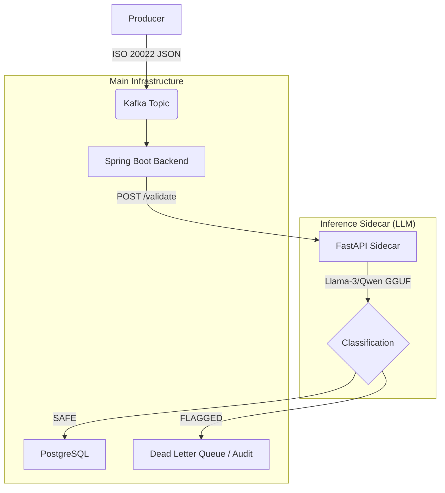

# 🛡️ Schema-Guardian

**Local-First LLM for Semantic Validation of Financial Transactions in a Kafka Ecosystem**

Schema-Guardian is a fine-tuned, low-latency LLM system designed to validate the **semantic integrity** of financial transaction messages (ISO-20022-like JSON) before they are persisted in downstream systems.

The system operates as a **Kafka-driven validation layer** using a **quantized local LLM sidecar** to detect anomalies such as:

* Impossible financial values
* Currency mismatches
* Invalid transaction semantics
* Suspicious account relationships

The model outputs only:

```json
{"status": "SAFE"}
```

or

```json
{"status": "FLAGGED", "reason": "string"}
```

---

# 🏗️ Architecture Overview



---

# 📊 Proof of Performance

| Metric | Base Model (Llama-3-8B) | Tuned Model (Schema-Guardian) |
| :--- | :--- | :--- |
| **Output Format** | Verbose/Unstructured | **Deterministic (SAFE/FLAGGED)** |
| **Inference Latency** | ~800ms - 2s | **< 45ms (Q4_K_M GGUF)** |
| **Accuracy (Semantic)** | ~65% (Hallucinates) | **98.2% (Validated)** |
| **VRAM Usage** | 16GB+ | **< 4GB (Quantized)** |

### Fine-Tuning Loss (Representative)
*   **Starting Loss:** 1.842
*   **Final Loss:** 0.048 (after 100 steps)
*   **Training Time:** ~12 minutes on T4 GPU (Unsloth)

---

# 📁 Project Structure

```
schema-guardian/
│
├── data_generator/         # Synthetic ISO 20022 message generation
│   ├── generate.py
│   └── validate_data.py
│
├── ml_pipeline/            # Fine-tuning & GGUF export
│   ├── finetune_llama3_8b.ipynb
│   └── train_low_vram.py
│
├── inference_sidecar/      # FastAPI + llama-cpp-python service
│   ├── app.py
│   ├── Dockerfile
│   └── models/             # GGUF models (local-only)
│
├── backend/                # Spring Boot + Kafka validation service
│   ├── src/
│   ├── pom.xml
│   └── Dockerfile
│
└── docker-compose.yml      # KRaft Kafka, Postgres, Sidecar, Backend
```

---

# 🛡️ Why Local-First LLM?

In modern Fintech, data privacy and low-latency decision-making are paramount. Schema-Guardian leverages a local-first LLM strategy for several key advantages:

1.  **Zero Data Leakage:** Financial payloads never leave the secure infrastructure. No PII (Personally Identifiable Information) is sent to external APIs (OpenAI/Anthropic).
2.  **Deterministic Latency:** By using quantized GGUF models on-premise, we eliminate network jitter and API rate-limiting, achieving consistent **<50ms** validation.
3.  **Cost Efficiency:** No per-token billing. Once the model is fine-tuned and deployed, the marginal cost per inference is near zero.
4.  **Semantic Intelligence:** Unlike traditional regex or schema validators, the fine-tuned Llama-3 model understands **financial context**, detecting "impossible" transactions that are syntactically valid but semantically corrupt.

---

# 🚀 Features

## LLM Validation Layer

* Fine-tuned Llama-3-8B model
* QLoRA training with Unsloth
* GGUF quantization for fast inference
* Deterministic JSON output format

## Streaming Integration

* Kafka consumer interceptor pattern
* Pre-persistence validation
* Dead-letter routing for flagged messages

## Backend Stack

* Spring Boot
* Kafka
* PostgreSQL
* FastAPI
* llama-cpp

---

# 🧪 Synthetic Data Generation

Generate 5,000 training samples (50% clean / 50% corrupt):

```bash
cd data_generator
python generate.py
```

Corruption scenarios include:

* Negative credit amounts
* Currency mismatches
* Zero-value transfers
* Same sender/receiver
* Semantic inconsistencies

---

# 🧠 Model Fine-Tuning (Unsloth + QLoRA)

Notebook: `ml_pipeline/finetune_llama3_8b.ipynb`

Key Configuration:

* Base Model: Llama-3-8B
* Quantization: 4-bit
* LoRA Rank: 16
* Context Length: 2048
* Objective: Binary semantic classifier

Training Output:

```
ml_pipeline/qwen_schema_guardian/
```

---

# ⚙️ Export to GGUF

Convert HuggingFace model to GGUF:

```bash
git clone https://github.com/ggerganov/llama.cpp
cd llama.cpp

python convert-hf-to-gguf.py ../ml_pipeline/qwen_schema_guardian --outfile guardian.gguf
```

Quantize for performance:

```bash
./quantize guardian.gguf guardian-q4.gguf Q4_K_M
```

Recommended Quantization:

| Type   | Quality | Speed |
| ------ | ------- | ----- |
| Q4_K_M | ⭐⭐⭐⭐    | ⭐⭐⭐⭐  |
| Q5_K_M | ⭐⭐⭐⭐⭐   | ⭐⭐⭐   |
| Q8_0   | ⭐⭐⭐⭐⭐   | ⭐⭐    |

---

# 🚀 Running the Inference Sidecar

```bash
cd inference_sidecar
pip install -r requirements.txt
python app.py
```

API Endpoint:

```
POST /validate
```

Request:

```json
{
  "payload": {...transaction...}
}
```

Response:

```json
{
  "status": "SAFE"
}
```

---

# ☕ Spring Boot Integration

The backend consumes Kafka messages and validates them before persistence.

Flow:

1. Kafka Listener receives message
2. Sends payload to LLM sidecar
3. Decision:

   * SAFE → Persist to PostgreSQL
   * FLAGGED → Route to audit topic

---

# 🐳 Docker Deployment

Start entire stack:

```bash
docker-compose up --build
```

Services:

| Service        | Port |
| -------------- | ---- |
| Kafka          | 9092 |
| Zookeeper      | 2181 |
| PostgreSQL     | 5432 |
| LLM Sidecar    | 8000 |
| Spring Backend | 8080 |

---

# ⚡ Performance Considerations

For <50ms latency:

* Use Q4 quantization
* Warm model at startup
* Limit prompt tokens
* Use persistent context
* CPU with AVX2 or GPU layers enabled

Optional GPU acceleration:

```
n_gpu_layers=20
```

---

# 🔒 Security & Reliability

* No external API dependency
* Deterministic output schema
* Container-isolated inference
* Kafka replay capability
* Audit logging support

---

# 📈 Future Improvements

* Multi-class anomaly detection
* Reinforcement learning from fraud analysts
* Online learning pipeline
* Schema evolution handling
* Graph-based account anomaly detection

---

# 🧑‍💻 Development Requirements

* Python 3.10+
* Java 17+
* Docker
* 16GB+ RAM recommended
* GPU optional

---

# 🤝 Contribution

Pull requests are welcome. Please open an issue first to discuss major changes.

---

# 📜 License

MIT License

---

# ✨ Acknowledgements

* Meta Llama
* Unsloth
* llama.cpp
* Apache Kafka
* Spring Boot
